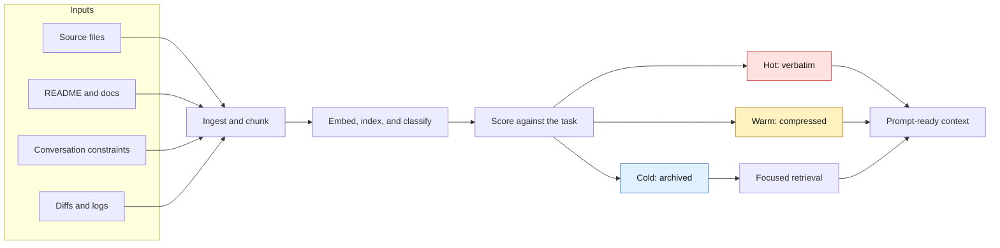
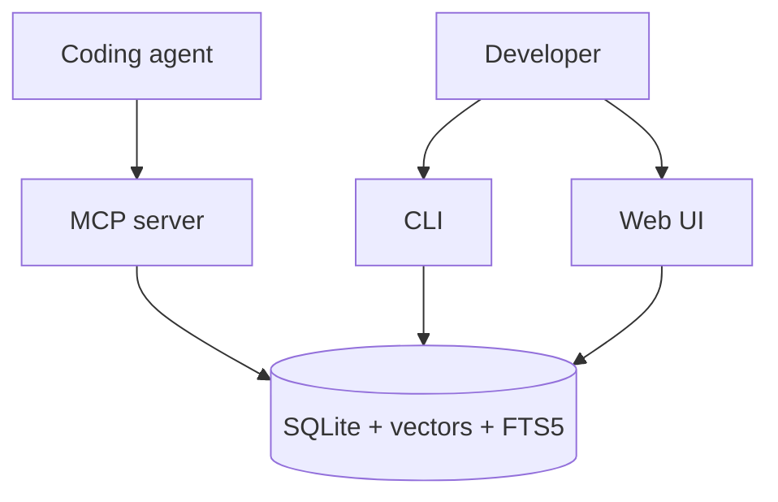

<p align="center">
  
  
  
  
</p>

<p align="center">
  
</p>

<p align="center">
  <strong>Local codebase context engine for coding agents.</strong><br />
  Find the right files, symbols, and snippets before an agent edits.
</p>

<p align="center">
  <a href="#quick-start">Quick Start</a> |
  <a href="#how-it-works">How It Works</a> |
  <a href="#core-surfaces">Surfaces</a> |
  <a href="#large-repository-benchmarks">Benchmarks</a> |
  <a href="#documentation">Docs</a> |
  <a href="#development">Development</a>
</p>

---

## What Spacefolding Does

Spacefolding helps coding agents start with the right local repository context.
Before an agent edits code, it ranks the files, symbols, and snippets most
likely to matter for the task, then returns a prompt-sized bundle the agent can
read immediately.

Use it when the repository is too large for an agent to scan reliably, when
keyword search is too brittle, or when you want an MCP/local workflow that keeps
codebase context on your machine.

The payoff is fewer blind starts. On the completed Django, Spring Framework,
and Rust held-out benchmark runs, structural retrieval put the target file in
the top 10 results 139 / 180 times. Keyword search did that 35 / 180 times.

| Problem | Spacefolding response |
| --- | --- |
| The repo is larger than the model context window. | Index the repo once, then retrieve only the files and chunks that match the current task. |
| Keyword search misses code because names are indirect. | Use paths, symbols, references, FTS, vectors, and dependency signals together. |
| The agent needs exact requirements and source snippets. | Keep high-priority constraints and active code hot, without summarizing them away. |
| Useful background is too verbose. | Compress warm context into structured summaries with source links. |
| Old context might matter later. | Keep cold context in SQLite so it can be searched instead of discarded. |

| If you ask an agent to... | Spacefolding is useful when it can... |
| --- | --- |
| Fix a bug in unfamiliar code. | Put the likely owning files and symbols in front of the agent before it guesses. |
| Add a feature across a large repo. | Retrieve the interfaces, implementations, and related references that define the pattern. |
| Explain a subsystem. | Return a compact trail of source files instead of forcing the agent to scan the whole tree. |
| Work inside a long-running session. | Preserve decisions, constraints, and older context without carrying all of it in every prompt. |

## How It Works



| Tier | Stored as | Typical use |
| --- | --- | --- |
| Hot | Full text | Current task constraints, active files, exact requirements |
| Warm | Structured summary plus source link | Useful APIs, design notes, related files |
| Cold | Indexed archive | Older logs, distant files, background material |

## Quick Start

Use Docker for the fastest isolated setup:

```bash
git clone https://github.com/BColsey/spacefolding.git
cd spacefolding
cp .env.example .env
docker compose up --build
```

Verify the container:

```bash
docker compose exec spacefolding node dist/main.js health
```

Or run locally:

```bash
npm install
npm run build
node dist/main.js download-model
node dist/main.js ingest-project .
node dist/main.js retrieve --query "how does routing work" --mode focused
node dist/main.js retrieve --query "fix auth timeout" --format pack
```

For the full setup path, see the [quick-start tutorial](docs/tutorials/quick-start.md).

## Core Surfaces



| Surface | Use it when | Start here |
| --- | --- | --- |
| CLI | You want local ingestion, retrieval, exports, or benchmarks. | [CLI reference](docs/reference/cli.md) |
| MCP server | You want Claude Code or another MCP client to call Spacefolding as tools. | [Claude Code integration](docs/integration-guide.md) |
| Web UI | You want to inspect chunks and routing state in a browser. | [Configuration](docs/configuration.md#web-ui) |
| Benchmarks | You want to evaluate retrieval quality and token efficiency. | [Run benchmarks](docs/howto/run-benchmarks.md) |

## Feature Map

| Area | Highlights |
| --- | --- |
| Retrieval | Structural, vector, text, hybrid, and graph strategies with focused/broad/exhaustive modes |
| Chunking | Code, Markdown, and plain-text splitting with overlap and parent-child links |
| Embeddings | Local ONNX, CUDA-backed Python subprocess, or deterministic fallback |
| Compression | Deterministic, local, OpenAI-compatible LLM, or LLMLingua providers |
| Storage | SQLite persistence, FTS5, vector index cache, code symbols, and dependencies |
| Integration | Docker, CLI, stdio/SSE MCP transport, web inspector, import/export |

## Large Repository Benchmarks

The benchmark is designed around the workflow Spacefolding is meant to improve:
before a coding agent edits, can the context engine put the file it will need in
the first few results?

Held-out tasks are generated from real files in large repositories outside this
project. Each task has a known target file. Retrieval methods are scored by how
early that target appears in the ranked list:

| Metric | What it means for an agent |
| --- | --- |
| R@10 | The needed file appears somewhere in the first 10 retrieved paths. |
| NDCG@10 | The needed file appears high in the first 10, not buried near the bottom. |
| MRR | The first correct hit appears early. A score near 1 means rank 1. |

The large-repository snapshot captured on May 27, 2026 showed Spacefolding's
structural retrieval finding the target file in the top 10 much more often than
simple methods on completed 60-task held-out runs:

- Combined: 139 / 180 with structural retrieval, compared with 35 / 180 for
  keyword search.
- Django: 53 / 60 with structural retrieval, compared with 16 / 60 for keyword
  search.
- Spring Framework: 48 / 60 with structural retrieval, compared with 14 / 60 for
  keyword search.
- Rust: 38 / 60 with structural retrieval, compared with 5 / 60 for keyword
  search.

That is the main benchmark claim: Spacefolding is better at getting the likely
target files in front of the agent before the agent spends tokens on the wrong
part of the repository. Structural retrieval does this by combining paths,
symbols, references, FTS, vectors, and dependency signals instead of relying on
one search signal alone.

A larger Kibana retry tested a 1.8 GB checkout with 63,399 supported source
files and 222,701 extracted symbols. In that 20-task structural run, every
target file appeared in the first 10 results, with the first correct file
usually near the top.

See [large repository held-out results](benchmarks/LARGE-REPO-HELDOUT.md) for
the full tables, commands, and caveats.

## Documentation

| Reader goal | Document |
| --- | --- |
| Start from scratch. | [Quick-start tutorial](docs/tutorials/quick-start.md) |
| Decide whether Spacefolding fits. | [Why Spacefolding](docs/concepts/why-spacefolding.md) |
| Understand the model. | [How Spacefolding works](docs/concepts/how-spacefolding-works.md) |
| Tune retrieval behavior. | [Retrieval pipeline](docs/concepts/retrieval-pipeline.md) |
| Use command-line commands. | [CLI reference](docs/reference/cli.md) |
| Integrate with Claude Code. | [Claude Code integration](docs/integration-guide.md) |
| Look up MCP tools. | [MCP tools reference](docs/reference/mcp-tools.md) |
| Configure providers and ports. | [Configuration reference](docs/configuration.md) |
| Navigate everything. | [Documentation index](docs/index.md) |

## Development

```bash
npm run build
npm run lint
npm test
```

Benchmark commands and acceptance criteria are documented in [run benchmarks](docs/howto/run-benchmarks.md). Current benchmark snapshots live in [benchmarks/RESULTS.md](benchmarks/RESULTS.md), [benchmarks/E2E-RESULTS.md](benchmarks/E2E-RESULTS.md), and [benchmarks/LARGE-REPO-HELDOUT.md](benchmarks/LARGE-REPO-HELDOUT.md).

## Contributing, Security, License

See [CONTRIBUTING.md](CONTRIBUTING.md) for development workflow and [SECURITY.md](SECURITY.md) for vulnerability reporting.

Spacefolding is free for personal, educational, and noncommercial projects.
Commercial or business use requires a paid license; see [LICENSE](LICENSE).
