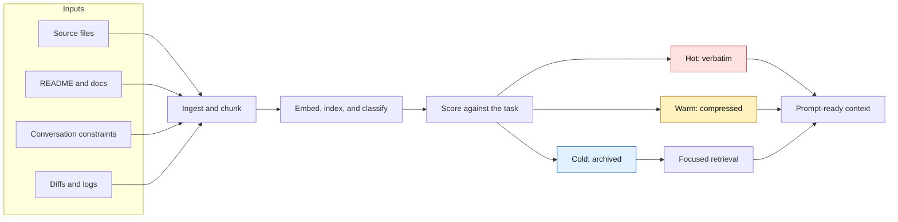
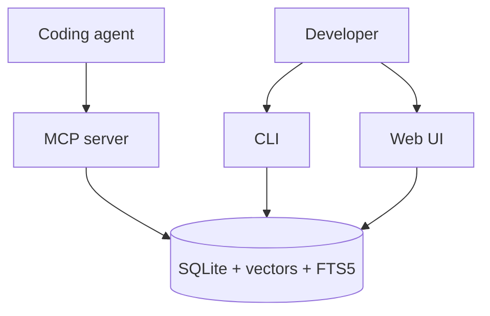

<p align="center">
  
  
  
  
</p>

<p align="center">
  
</p>

<p align="center">
  <strong>Local-first context compression and retrieval for coding agents.</strong><br />
  Fold oversized repos, conversations, logs, and docs into prompt-ready context.
</p>

<p align="center">
  <a href="#quick-start">Quick Start</a> |
  <a href="#how-it-works">How It Works</a> |
  <a href="#core-surfaces">Surfaces</a> |
  <a href="#large-repository-benchmarks">Benchmarks</a> |
  <a href="#documentation">Docs</a> |
  <a href="#development">Development</a>
</p>

---

## What Spacefolding Does

Coding agents fail in predictable ways on large codebases: they search for the
wrong words, read the wrong files, miss the symbol that matters, or dump too
much code into the prompt and lose the thread. Spacefolding is a local context
engine that gives an agent a ranked, prompt-sized bundle of the files and
snippets most likely to matter for the task.

The practical value is simple: before an agent edits code, Spacefolding helps it
find the right part of the repository.

| Problem | Spacefolding response |
| --- | --- |
| The repo is larger than the model context window. | Index the repo once, then retrieve only the files and chunks that match the current task. |
| Keyword search misses code because names are indirect. | Use paths, symbols, references, FTS, vectors, and dependency signals together. |
| The agent needs exact requirements and source snippets. | Keep high-priority constraints and active code hot, without summarizing them away. |
| Useful background is too verbose. | Compress warm context into structured summaries with source links. |
| Old context might matter later. | Keep cold context in SQLite so it can be searched instead of discarded. |

| If you ask an agent to... | Spacefolding is useful when it can... |
| --- | --- |
| Fix a bug in unfamiliar code. | Put the likely owning files and symbols in front of the agent before it guesses. |
| Add a feature across a large repo. | Retrieve the interfaces, implementations, and related references that define the pattern. |
| Explain a subsystem. | Return a compact trail of source files instead of forcing the agent to scan the whole tree. |
| Work inside a long-running session. | Preserve decisions, constraints, and older context without carrying all of it in every prompt. |

## How It Works



| Tier | Stored as | Typical use |
| --- | --- | --- |
| Hot | Full text | Current task constraints, active files, exact requirements |
| Warm | Structured summary plus source link | Useful APIs, design notes, related files |
| Cold | Indexed archive | Older logs, distant files, background material |

## Quick Start

Use Docker for the fastest isolated setup:

```bash
git clone https://github.com/BColsey/spacefolding.git
cd spacefolding
cp .env.example .env
docker compose up --build
```

Verify the container:

```bash
docker compose exec spacefolding node dist/main.js health
```

Or run locally:

```bash
npm install
npm run build
node dist/main.js download-model
node dist/main.js ingest-project .
node dist/main.js retrieve --query "how does routing work" --mode focused
```

For the full setup path, see the [quick-start tutorial](docs/tutorials/quick-start.md).

## Core Surfaces



| Surface | Use it when | Start here |
| --- | --- | --- |
| CLI | You want local ingestion, retrieval, exports, or benchmarks. | [CLI reference](docs/reference/cli.md) |
| MCP server | You want Claude Code or another MCP client to call Spacefolding as tools. | [Claude Code integration](docs/integration-guide.md) |
| Web UI | You want to inspect chunks and routing state in a browser. | [Configuration](docs/configuration.md#web-ui) |
| Benchmarks | You want to evaluate retrieval quality and token efficiency. | [Run benchmarks](docs/howto/run-benchmarks.md) |

## Feature Map

| Area | Highlights |
| --- | --- |
| Retrieval | Structural, vector, text, hybrid, and graph strategies with focused/broad/exhaustive modes |
| Chunking | Code, Markdown, and plain-text splitting with overlap and parent-child links |
| Embeddings | Local ONNX, CUDA-backed Python subprocess, or deterministic fallback |
| Compression | Deterministic, local, OpenAI-compatible LLM, or LLMLingua providers |
| Storage | SQLite persistence, FTS5, vector index cache, code symbols, and dependencies |
| Integration | Docker, CLI, stdio/SSE MCP transport, web inspector, import/export |

## Large Repository Benchmarks

The retrieval benchmark asks a concrete agent question: when the task requires
a specific source file, does Spacefolding put that file near the top before the
agent spends tokens reading the wrong code?

The generated held-out tasks are built from real files in repositories that are
not part of this project. A good result means the target file appears early in
the ranked retrieval list:

| Metric | What it means for an agent |
| --- | --- |
| R@10 | The needed file appears somewhere in the first 10 retrieved paths. |
| NDCG@10 | The needed file appears high in the first 10, not buried near the bottom. |
| MRR | The first correct hit appears early. A score near 1 means rank 1. |

The large-repository snapshot captured on May 27, 2026 showed structural
retrieval beating keyword search on completed 60-task held-out runs for Django,
Spring Framework, and Rust. That matters because keyword search is the obvious
baseline: if structural retrieval only matched grep-like search, it would not be
worth using.

Read the benchmark as "how often did the method put the needed file in front of
the agent?" On the completed 60-task held-out runs, structural retrieval found
the target file in the top 10 much more often:

| Repository | Keyword search | FTS | Symbol only | Spacefolding structural |
| --- | ---: | ---: | ---: | ---: |
| Django | 16 / 60 | 40 / 60 | 48 / 60 | 53 / 60 |
| Spring Framework | 14 / 60 | 33 / 60 | 26 / 60 | 48 / 60 |
| Rust | 5 / 60 | 34 / 60 | 34 / 60 | 38 / 60 |

The important comparison is not only "structural beats keyword." It is that the
combined structural strategy is more robust than any one signal by itself:

| Method | Why it is useful | Where it breaks down |
| --- | --- | --- |
| Keyword search | Fast grep-like baseline over text and paths. | Misses when the task uses different words than the code. |
| FTS | Strong lexical search with better ranking than simple keyword matching. | Still mostly depends on words appearing in the file. |
| Symbol only | Good when the task names the exact class, function, or type. | Misses path intent, references, and broader implementation clues. |
| Vector only | Useful with strong embeddings and semantic phrasing. | Weak with deterministic fallback embeddings in these held-out runs. |
| Structural | Combines paths, symbols, references, FTS, vectors, and dependency signals. | Costs more to index and retrieve on very large repos. |

The largest retry was Kibana, a 1.8 GB checkout with 63,399 supported source
files and 222,701 extracted symbols. The original single-task benchmark path
timed out after one hour on a 5-task structural run. With parallel task
evaluation and a larger benchmark chunk cap, Kibana completed a 20-task
structural run in 6:45 with R@10 `1.000`, NDCG@10 `0.822`, and MRR `0.769`.
In plain terms: every generated Kibana task found its target file in the first
10 results, and the first correct file was usually near the top.

```bash
npx tsx benchmarks/evaluate.ts \
  --dataset /tmp/spacefolding-heldout-kibana-20.json \
  --corpus corpora/kibana \
  --strategy structural \
  --workers 10 \
  --max-chunks 1000000 \
  --json > /tmp/spacefolding-heldout-kibana-20-structural.json
```

This mode still ingests the corpus once into a temporary SQLite benchmark
artifact. After ingest, `--workers N` shards benchmark tasks across worker
threads; each worker opens its own repository connection and evaluates its task
shard against the shared artifact. `--max-chunks N` raises the benchmark chunk
limit so large-corpus runs measure retrieval quality instead of repeatedly
triggering the production eviction cap. On Kibana, the 10-worker retrieval phase
used ten CPU cores and peaked around 31 GB RSS, so it is intended for capable
local machines.

See [large repository held-out results](benchmarks/LARGE-REPO-HELDOUT.md) for
the full tables, commands, and caveats.

## Documentation

| Reader goal | Document |
| --- | --- |
| Start from scratch. | [Quick-start tutorial](docs/tutorials/quick-start.md) |
| Understand the model. | [How Spacefolding works](docs/concepts/how-spacefolding-works.md) |
| Tune retrieval behavior. | [Retrieval pipeline](docs/concepts/retrieval-pipeline.md) |
| Use command-line commands. | [CLI reference](docs/reference/cli.md) |
| Integrate with Claude Code. | [Claude Code integration](docs/integration-guide.md) |
| Look up MCP tools. | [MCP tools reference](docs/reference/mcp-tools.md) |
| Configure providers and ports. | [Configuration reference](docs/configuration.md) |
| Navigate everything. | [Documentation index](docs/index.md) |

## Development

```bash
npm run build
npm run lint
npm test
```

Benchmark commands and acceptance criteria are documented in [run benchmarks](docs/howto/run-benchmarks.md). Current benchmark snapshots live in [benchmarks/RESULTS.md](benchmarks/RESULTS.md), [benchmarks/E2E-RESULTS.md](benchmarks/E2E-RESULTS.md), and [benchmarks/LARGE-REPO-HELDOUT.md](benchmarks/LARGE-REPO-HELDOUT.md).

## Contributing, Security, License

See [CONTRIBUTING.md](CONTRIBUTING.md) for development workflow and [SECURITY.md](SECURITY.md) for vulnerability reporting.

Spacefolding is free for personal, educational, and noncommercial projects.
Commercial or business use requires a paid license; see [LICENSE](LICENSE).
