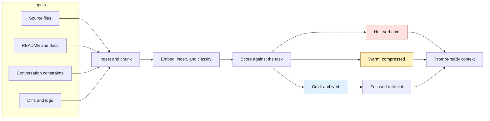
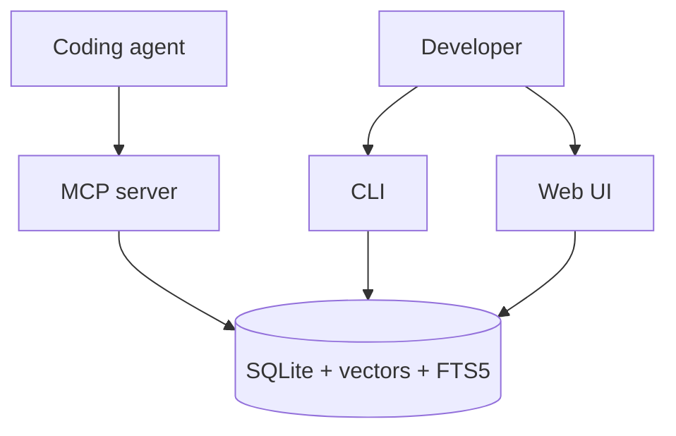

<p align="center">
  
  
  
  
</p>

<p align="center">
  
</p>

<p align="center">
  <strong>Local-first context compression and retrieval for coding agents.</strong><br />
  Fold oversized repos, conversations, logs, and docs into prompt-ready context.
</p>

<p align="center">
  <a href="#quick-start">Quick Start</a> |
  <a href="#how-it-works">How It Works</a> |
  <a href="#core-surfaces">Surfaces</a> |
  <a href="#large-repository-benchmarks">Benchmarks</a> |
  <a href="#documentation">Docs</a> |
  <a href="#development">Development</a>
</p>

---

## What Spacefolding Does

Coding agents need the right context, not all context. Spacefolding ingests project material, scores it against a task, routes it into hot/warm/cold tiers, and retrieves a compact set of useful chunks when the prompt window is smaller than the workspace.

| Problem | Spacefolding response |
| --- | --- |
| The repo is larger than the model context window. | Chunk, embed, index, and retrieve only the relevant pieces. |
| Some facts must stay exact. | Keep high-priority constraints and source snippets hot. |
| Useful background is too verbose. | Compress warm context into structured summaries. |
| Old context might matter later. | Store cold context in SQLite, vector search, FTS5, and a dependency graph. |

## How It Works



| Tier | Stored as | Typical use |
| --- | --- | --- |
| Hot | Full text | Current task constraints, active files, exact requirements |
| Warm | Structured summary plus source link | Useful APIs, design notes, related files |
| Cold | Indexed archive | Older logs, distant files, background material |

## Quick Start

Use Docker for the fastest isolated setup:

```bash
git clone https://github.com/BColsey/spacefolding.git
cd spacefolding
cp .env.example .env
docker compose up --build
```

Verify the container:

```bash
docker compose exec spacefolding node dist/main.js health
```

Or run locally:

```bash
npm install
npm run build
node dist/main.js download-model
node dist/main.js ingest-project .
node dist/main.js retrieve --query "how does routing work" --mode focused
```

For the full setup path, see the [quick-start tutorial](docs/tutorials/quick-start.md).

## Core Surfaces



| Surface | Use it when | Start here |
| --- | --- | --- |
| CLI | You want local ingestion, retrieval, exports, or benchmarks. | [CLI reference](docs/reference/cli.md) |
| MCP server | You want Claude Code or another MCP client to call Spacefolding as tools. | [Claude Code integration](docs/integration-guide.md) |
| Web UI | You want to inspect chunks and routing state in a browser. | [Configuration](docs/configuration.md#web-ui) |
| Benchmarks | You want to evaluate retrieval quality and token efficiency. | [Run benchmarks](docs/howto/run-benchmarks.md) |

## Feature Map

| Area | Highlights |
| --- | --- |
| Retrieval | Structural, vector, text, hybrid, and graph strategies with focused/broad/exhaustive modes |
| Chunking | Code, Markdown, and plain-text splitting with overlap and parent-child links |
| Embeddings | Local ONNX, CUDA-backed Python subprocess, or deterministic fallback |
| Compression | Deterministic, local, OpenAI-compatible LLM, or LLMLingua providers |
| Storage | SQLite persistence, FTS5, vector index cache, code symbols, and dependencies |
| Integration | Docker, CLI, stdio/SSE MCP transport, web inspector, import/export |

## Large Repository Benchmarks

The large-repository snapshot captured on May 27, 2026 showed structural
retrieval beating keyword search on completed 60-task held-out runs for Django,
Spring Framework, and Rust. The largest retry, Kibana, originally timed out
after one hour on a 5-task structural run. With parallel task evaluation and a
larger benchmark chunk cap, Kibana completed a 20-task structural run in 6:45
with R@10 `1.000`, NDCG@10 `0.822`, and MRR `0.769`.

```bash
npx tsx benchmarks/evaluate.ts \
  --dataset /tmp/spacefolding-heldout-kibana-20.json \
  --corpus corpora/kibana \
  --strategy structural \
  --workers 10 \
  --max-chunks 1000000 \
  --json > /tmp/spacefolding-heldout-kibana-20-structural.json
```

This mode still ingests the corpus once into a temporary SQLite benchmark
artifact. After ingest, `--workers N` shards benchmark tasks across worker
threads; each worker opens its own repository connection and evaluates its task
shard against the shared artifact. `--max-chunks N` raises the benchmark chunk
limit so large-corpus runs measure retrieval quality instead of repeatedly
triggering the production eviction cap. On Kibana, the 10-worker retrieval phase
used ten CPU cores and peaked around 31 GB RSS, so it is intended for capable
local machines.

See [large repository held-out results](benchmarks/LARGE-REPO-HELDOUT.md) for
the full tables, commands, and caveats.

## Documentation

| Reader goal | Document |
| --- | --- |
| Start from scratch. | [Quick-start tutorial](docs/tutorials/quick-start.md) |
| Understand the model. | [How Spacefolding works](docs/concepts/how-spacefolding-works.md) |
| Tune retrieval behavior. | [Retrieval pipeline](docs/concepts/retrieval-pipeline.md) |
| Use command-line commands. | [CLI reference](docs/reference/cli.md) |
| Integrate with Claude Code. | [Claude Code integration](docs/integration-guide.md) |
| Look up MCP tools. | [MCP tools reference](docs/reference/mcp-tools.md) |
| Configure providers and ports. | [Configuration reference](docs/configuration.md) |
| Navigate everything. | [Documentation index](docs/index.md) |

## Development

```bash
npm run build
npm run lint
npm test
```

Benchmark commands and acceptance criteria are documented in [run benchmarks](docs/howto/run-benchmarks.md). Current benchmark snapshots live in [benchmarks/RESULTS.md](benchmarks/RESULTS.md), [benchmarks/E2E-RESULTS.md](benchmarks/E2E-RESULTS.md), and [benchmarks/LARGE-REPO-HELDOUT.md](benchmarks/LARGE-REPO-HELDOUT.md).

## Contributing, Security, License

See [CONTRIBUTING.md](CONTRIBUTING.md) for development workflow and [SECURITY.md](SECURITY.md) for vulnerability reporting.

Spacefolding is free for personal, educational, and noncommercial projects.
Commercial or business use requires a paid license; see [LICENSE](LICENSE).
