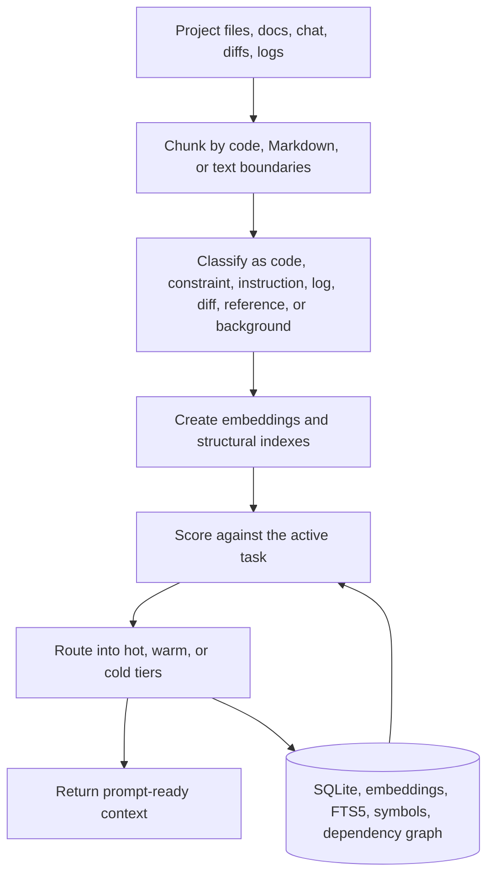
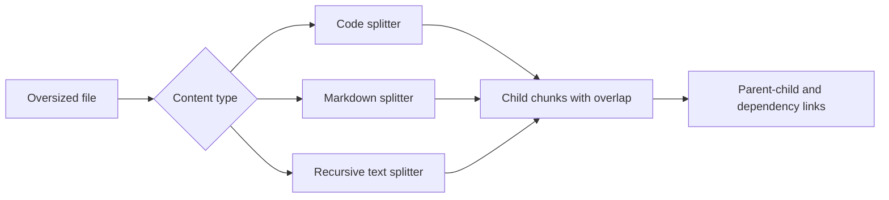

# How Spacefolding Works

Spacefolding is a local context service for coding agents. It keeps important context exact, summarizes useful context, and archives everything else so it can be retrieved later.

## Context Lifecycle

The database remains the source of truth. Vector indexes and retrieval caches can be rebuilt from stored chunks and embeddings.

## Routing Tiers

| Tier | What is stored | Why it exists |
| --- | --- | --- |
| Hot | Full text | Preserve exact constraints, active source, and must-use facts. |
| Warm | Compressed summary with source chunk IDs | Keep useful context compact while preserving provenance. |
| Cold | Indexed archive | Avoid prompt bloat while keeping old material searchable. |

Hot context is intentionally scarce. Warm context keeps signal without paying the full token cost. Cold context is not discarded; it is searched through retrieval when the task needs it.

## Scoring Model

Every chunk receives a composite score for the current task:

| Factor | Default weight | Meaning |
| --- | ---: | --- |
| Semantic similarity | 0.30 | Does this chunk match the task meaning? |
| Constraint priority | 0.25 | Is this a hard requirement or instruction? |
| Recency | 0.20 | Was this context produced recently? |
| Redundancy | 0.10 | Is this repeating other context? |
| Dependencies | 0.15 | Does another important chunk depend on this one? |

The router compares the score with hot and warm thresholds. Dependency links can pull related chunks upward when they are needed to understand a hot chunk.

## Chunking

The splitter uses code, Markdown, or recursive text boundaries. Overlap reduces information loss at chunk edges, and child chunks are scored independently.

## Local-First Design

Spacefolding runs as a local process or Docker container. It can use cloud-compatible LLM APIs for warm-context compression, but the default setup uses local embeddings and deterministic compression.

| Component | Default behavior |
| --- | --- |
| Database | SQLite under `./data/spacefolding.db` |
| Embeddings | Local ONNX model, cached under `./data/models` |
| Compression | Deterministic summary extraction |
| Transport | MCP over stdio |
| Web UI | Disabled until `WEB_PORT` is set |

## See Also

- [Retrieval pipeline](./retrieval-pipeline.md)
- [Architecture reference](../reference/architecture.md)
- [Configuration reference](../configuration.md)
