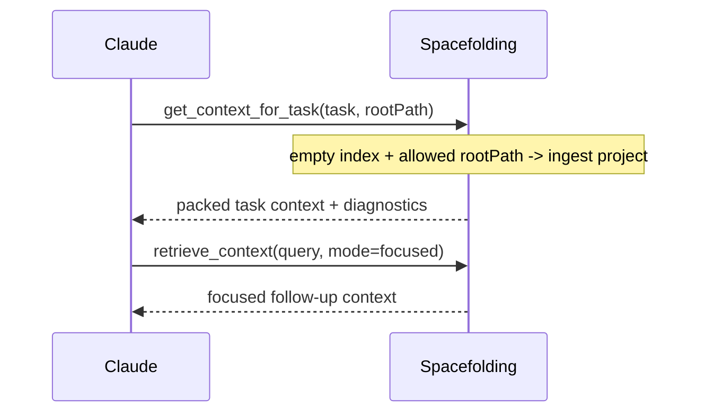

# Claude Code Integration

Use this guide to connect Claude Code to Spacefolding through the Model Context Protocol.

## Prerequisites

- Spacefolding is installed (`npm install -g spacefolding`, or built from source with `npm run build`).
- Claude Code can run `node` or `docker` from the configured environment.

## Local Node.js Setup (recommended)

Run `spacefolding init` from your project root. It pre-warms the embedding
model into a **shared global cache** (downloaded once per machine, reused across
all projects) and writes a machine-agnostic per-project `.mcp.json`:

```bash
spacefolding init
```

This writes `.mcp.json` in the current directory:

```json
{
  "mcpServers": {
    "spacefolding": {
      "type": "stdio",
      "command": "npx",
      "args": ["-y", "spacefolding", "serve"]
    }
  }
}
```

Claude Code auto-loads `.mcp.json` on session start. No separate model-download
step is required — the model is pre-warmed by `init`, and embed will retry
lazily on first use if the pre-warm was skipped or failed.

Notes:

- `MODEL_PATH` defaults to `${XDG_CACHE_HOME:-$HOME/.cache}/spacefolding/models`
  (shared globally). You do **not** need to set it in `.mcp.json`.
- `DB_PATH` defaults to `./data/spacefolding.db` (per-project). Each project gets
  its own database, so there is no global DB contention.
- For pre-publish / from-source use, pass `--local` to write a local dist-path
  form (`node /abs/path/dist/main.js serve`) instead of the `npx` form.

### Manual configuration (advanced)

You can also add Spacefolding without `init`, via `claude mcp add` (user-scoped)
or by hand-editing `.mcp.json` (project-scoped):

```bash
claude mcp add spacefolding -- node /path/to/spacefolding/dist/main.js serve
```

```json
{
  "mcpServers": {
    "spacefolding": {
      "command": "node",
      "args": ["/path/to/spacefolding/dist/main.js", "serve"]
    }
  }
}
```

To pre-fetch the model without `init` (e.g. for offline use or GPU priming), the
`download-model` subcommand is still available:

```bash
node dist/main.js download-model
```

## Docker Setup

Start the container:

```bash
docker compose up --build
```

Configure Claude Code to execute the server inside the running container:

```json
{
  "mcpServers": {
    "spacefolding": {
      "command": "docker",
      "args": [
        "compose",
        "-f",
        "/path/to/spacefolding/docker-compose.yml",
        "exec",
        "-T",
        "spacefolding",
        "node",
        "dist/main.js",
        "serve"
      ]
    }
  }
}
```

Download the local model inside the container:

```bash
docker compose exec spacefolding node dist/main.js download-model
```

## Recommended Agent Workflow



1. Use `get_context_for_task` as the one-call default. It ingests an allowed
   `rootPath` when the index is empty, then returns packed task context.
2. Use `ingest` when you want explicit control over project, directory, or
   single-item ingestion.
3. Use `retrieve_context` for focused follow-up context during implementation.
   Set `explain: true` or `score: true` when routing diagnostics are needed.
4. Use `get_relevant_memory` for warm/cold archived context searches.

The older tool names (`ingest_project`, `ingest_context`, `score_context`,
`explain_routing`, and others) remain callable for compatibility, but they are
not advertised as the primary MCP surface.

## First Tool Calls

One-call default:

```json
{
  "task": "Fix retrieval budget overflow in the focused pipeline",
  "rootPath": "/path/to/project",
  "maxTokens": 50000,
  "strategy": "structural",
  "mode": "focused"
}
```

Explicit project ingest:

```json
{
  "mode": "project",
  "path": "/path/to/project",
  "includeDocs": true,
  "includeTests": false,
  "includeBenchmarks": false
}
```

Retrieve context:

```json
{
  "query": "how does routing decide hot warm and cold tiers",
  "mode": "focused",
  "strategy": "structural",
  "maxTokens": 50000
}
```

Explain routing:

```json
{
  "task": { "text": "fix retrieval budget overflow" }
}
```

## Optional Web UI

Expose the web UI while serving MCP:

```bash
WEB_PORT=8080 WEB_HOST=127.0.0.1 node dist/main.js serve
```

Open `http://127.0.0.1:8080` to inspect chunks and routing state.

## Troubleshooting

| Symptom | Check |
| --- | --- |
| Claude Code cannot start the server. | Confirm the `args` path points to `dist/main.js` and run `npm run build`. |
| The model is missing. | Run `node dist/main.js download-model` or the Docker equivalent. |
| The database is empty. | Call `get_context_for_task` with an allowed `rootPath`, call `ingest` with `mode: "project"`, or run `node dist/main.js ingest-project /path/to/project`. |
| Docker command fails. | Confirm the container is running with `docker compose ps`. |
| Web UI is unreachable. | Set `WEB_PORT` and ensure `WEB_HOST=0.0.0.0` when accessing through Docker. |

## See Also

- [MCP tools reference](./reference/mcp-tools.md)
- [Configuration reference](./configuration.md)
- [Quick-start tutorial](./tutorials/quick-start.md)
