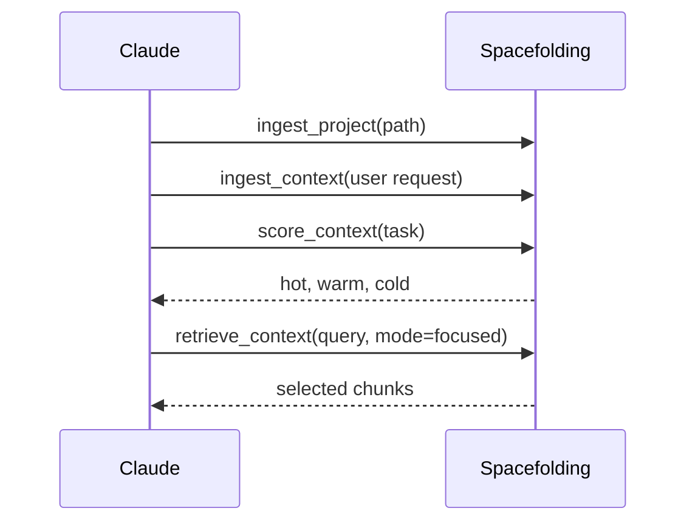

# Claude Code Integration

Use this guide to connect Claude Code to Spacefolding through the Model Context Protocol.

## Prerequisites

- Spacefolding is built with `npm run build`.
- The database and model paths are stable.
- Claude Code can run `node` or `docker` from the configured environment.

## Local Node.js Setup

Add Spacefolding to `.claude/settings.json`:

```json
{
  "mcpServers": {
    "spacefolding": {
      "command": "node",
      "args": ["/path/to/spacefolding/dist/main.js", "serve"],
      "env": {
        "DB_PATH": "/path/to/spacefolding/data/spacefolding.db",
        "MODEL_PATH": "/path/to/spacefolding/data/models",
        "EMBEDDING_PROVIDER": "local",
        "EMBEDDING_MODEL": "Xenova/bge-small-en-v1.5"
      }
    }
  }
}
```

Before using the tool, download the local model:

```bash
node dist/main.js download-model
```

## Docker Setup

Start the container:

```bash
docker compose up --build
```

Configure Claude Code to execute the server inside the running container:

```json
{
  "mcpServers": {
    "spacefolding": {
      "command": "docker",
      "args": [
        "compose",
        "-f",
        "/path/to/spacefolding/docker-compose.yml",
        "exec",
        "-T",
        "spacefolding",
        "node",
        "dist/main.js",
        "serve"
      ]
    }
  }
}
```

Download the local model inside the container:

```bash
docker compose exec spacefolding node dist/main.js download-model
```

## Recommended Agent Workflow



1. Use `ingest_project` at the start of work on a repository.
2. Use `ingest_context` for the user request, important constraints, logs, and diffs.
3. Use `score_context` when the agent needs tiered hot/warm/cold context.
4. Use `retrieve_context` for focused task context during implementation.
5. Use `explain_routing` when a routing result looks surprising.

## First Tool Calls

Ingest a project:

```json
{
  "path": "/path/to/project",
  "includeDocs": true,
  "includeTests": false,
  "includeBenchmarks": false
}
```

Retrieve context:

```json
{
  "query": "how does routing decide hot warm and cold tiers",
  "mode": "focused",
  "strategy": "structural",
  "maxTokens": 50000
}
```

Explain routing:

```json
{
  "task": { "text": "fix retrieval budget overflow" }
}
```

## Optional Web UI

Expose the web UI while serving MCP:

```bash
WEB_PORT=8080 WEB_HOST=127.0.0.1 node dist/main.js serve
```

Open `http://127.0.0.1:8080` to inspect chunks and routing state.

## Troubleshooting

| Symptom | Check |
| --- | --- |
| Claude Code cannot start the server. | Confirm the `args` path points to `dist/main.js` and run `npm run build`. |
| The model is missing. | Run `node dist/main.js download-model` or the Docker equivalent. |
| The database is empty. | Call `ingest_project` or run `node dist/main.js ingest-project /path/to/project`. |
| Docker command fails. | Confirm the container is running with `docker compose ps`. |
| Web UI is unreachable. | Set `WEB_PORT` and ensure `WEB_HOST=0.0.0.0` when accessing through Docker. |

## See Also

- [MCP tools reference](./reference/mcp-tools.md)
- [Configuration reference](./configuration.md)
- [Quick-start tutorial](./tutorials/quick-start.md)
