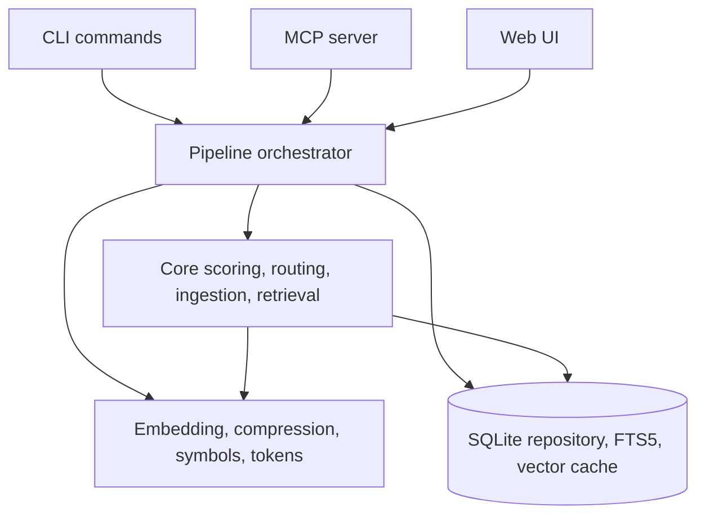
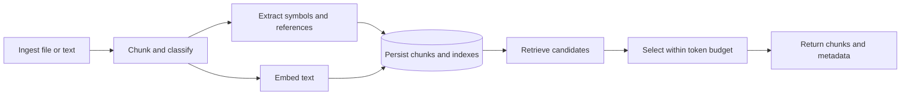

# Architecture Reference

Spacefolding is a TypeScript service with CLI, MCP, web, pipeline, provider, storage, and benchmark surfaces.

## Runtime Map

## Source Layout

| Path | Responsibility |
| --- | --- |
| `src/main.ts` | CLI entrypoint. |
| `src/cli/` | Commander.js commands and import/export helpers. |
| `src/core/` | Chunking, classification, scoring, routing, retrieval, query planning, file watching, and git-aware logic. |
| `src/pipeline/` | End-to-end orchestration for ingest, score, route, compress, retrieve, and persist. |
| `src/providers/` | Embeddings, compression providers, symbol extraction, token estimation, and dependency analysis. |
| `src/storage/` | SQLite schema, migrations, repository, FTS5, code structure, and vector index cache. |
| `src/mcp/` | MCP tool definitions and stdio/SSE transport. |
| `src/web/` | HTTP server and browser UI. |
| `src/types/` | Shared TypeScript types. |
| `tests/` | Vitest coverage for core behavior, retrieval, storage, benchmarks, and integration. |
| `benchmarks/` | Retrieval datasets, benchmark scripts, result snapshots, and acceptance checks. |

## Data Flow

## Storage

| Stored data | Purpose |
| --- | --- |
| Chunks | Canonical text, metadata, type, token estimate, parent/child links. |
| Embeddings | Model-specific vectors for semantic search. |
| FTS5 index | Keyword and BM25 search. |
| Code symbols | Functions, classes, interfaces, types, and references. |
| Dependency links | Relationships used by graph retrieval and routing boosts. |

## Runtime Surfaces

| Surface | Entrypoint | Notes |
| --- | --- | --- |
| CLI | `node dist/main.js` | Local commands for ingest, retrieval, export, and diagnostics. |
| MCP | `node dist/main.js serve` | Default stdio transport; SSE available with `--transport sse`. |
| Web UI | `WEB_PORT=8080 node dist/main.js serve` | Uses the same pipeline and database. |
| Docker | `docker compose up --build` | Persists `./data` and can expose MCP SSE and web ports. |

## See Also

- [How Spacefolding works](../concepts/how-spacefolding-works.md)
- [Configuration reference](../configuration.md)
- [CLI reference](./cli.md)
