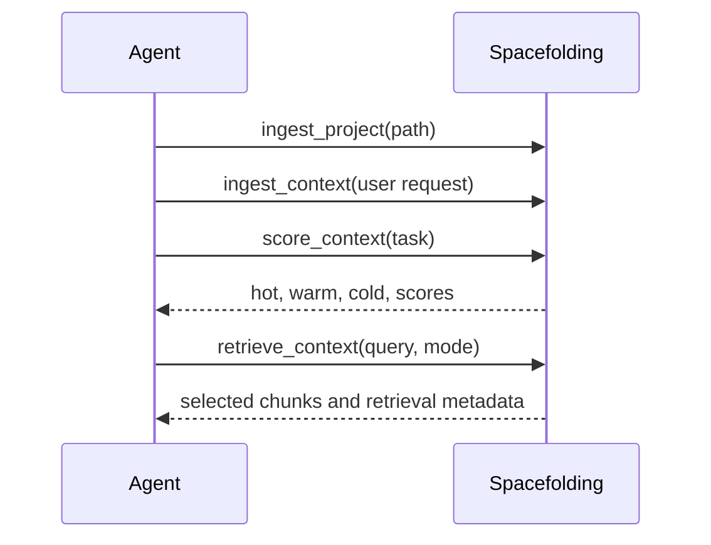

# MCP Tools Reference

Spacefolding exposes 12 MCP tools. They are designed for coding agents that need to ingest project context, route it, and retrieve compact task context.

## Tool Inventory

| Tool | Purpose |
| --- | --- |
| `ingest_context` | Add text, code, diffs, logs, constraints, or summaries. |
| `ingest_project` | Ingest source plus README/docs, env examples, config, and agent instruction files. |
| `ingest_directory` | Bulk-ingest files under a directory tree. |
| `score_context` | Score chunks for a task and route them into hot/warm/cold tiers. |
| `compress_context` | Compress specified chunks into a structured summary. |
| `get_relevant_memory` | Query warm/cold storage with optional filters. |
| `retrieve_context` | Run focused structural/vector/text retrieval with budget control. |
| `iterative_retrieve` | Run multi-round retrieval with query expansion. |
| `update_context_graph` | Add or remove dependency links. |
| `explain_routing` | Explain tier decisions and scoring reasons. |
| `list_context` | Show ingested chunk counts, token totals, and per-file breakdown. |
| `delete_context` | Delete specific chunks by ID. |

## Common Workflow



## ingest_context

Add one context item.

```json
{
  "source": "conversation",
  "text": "Must preserve existing CLI flags",
  "type": "constraint"
}
```

| Parameter | Required | Description |
| --- | --- | --- |
| `source` | Yes | Source label such as `conversation`, `file`, `diff`, `log`, or `summary`. |
| `text` | Yes | Context text. |
| `type` | No | Chunk type override. |
| `path` | No | File path when source is a file. |
| `language` | No | Programming language for code chunks. |

## ingest_project

Ingest a codebase with high-value project context.

```json
{
  "path": "/path/to/project",
  "includeDocs": true,
  "includeTests": false,
  "includeBenchmarks": false
}
```

| Parameter | Required | Default | Description |
| --- | --- | --- | --- |
| `path` | Yes | - | Absolute project directory path. |
| `includeDocs` | No | `true` | Include README files and `docs/**/*.md`. |
| `includeTests` | No | `false` | Include tests and specs. |
| `includeBenchmarks` | No | `false` | Include benchmark directories. |

## ingest_directory

Bulk-ingest a directory tree.

```json
{
  "path": "/path/to/project/src",
  "type": "code"
}
```

This skips `node_modules`, `.git`, `dist`, and binary files.

## score_context

Score chunks against a task.

```json
{
  "task": { "text": "Fix retrieval budget overflow" },
  "maxTokens": 50000
}
```

Optional `chunkIds` limits scoring to a subset.

## retrieve_context

Retrieve task-relevant context.

```json
{
  "query": "where does focused retrieval set target budgets",
  "strategy": "structural",
  "mode": "focused",
  "maxTokens": 50000,
  "returnLimit": 15,
  "maxHops": 0
}
```

| Parameter | Default | Description |
| --- | --- | --- |
| `query` | Required | Task-shaped query. |
| `maxTokens` | Adaptive | Hard budget for returned context. |
| `strategy` | Adaptive | `structural`, `hybrid`, `vector`, `text`, or `graph`. |
| `mode` | `focused` | `focused`, `broad`, or `exhaustive`. |
| `topK` | Adaptive | Retrieval candidates before selection. |
| `returnLimit` | `topK` | Scored candidates considered before budget fill. |
| `maxHops` | Strategy-dependent | Graph traversal hops. |

See [retrieval pipeline](../concepts/retrieval-pipeline.md) for strategy and mode details.

## iterative_retrieve

Run multi-round retrieval and expand the query from previous results.

```json
{
  "query": "how does project ingestion choose files",
  "rounds": 2,
  "maxTokens": 100000,
  "strategy": "structural"
}
```

## compress_context

Compress specified chunks.

```json
{
  "task": { "text": "Fix retrieval budget overflow" },
  "chunkIds": ["chunk-id-1", "chunk-id-2"]
}
```

Returns a summary, retained facts, retained constraints, and source chunk IDs.

## get_relevant_memory

Search stored context with optional filters.

```json
{
  "task": { "text": "How does JWT validation work?" },
  "filters": { "type": "code", "path": "src/auth" }
}
```

## update_context_graph

Add or remove dependency links.

```json
{
  "chunkId": "primary-id",
  "operation": "add",
  "dependencies": [
    {
      "fromId": "chunk-a",
      "toId": "chunk-b",
      "type": "references",
      "weight": 0.7
    }
  ]
}
```

Valid dependency types are `references`, `defines`, `summarizes`, `overrides`, and `contains`.

## explain_routing

Explain scoring and routing.

```json
{
  "task": { "text": "Fix retrieval budget overflow" },
  "chunkId": "optional-chunk-id"
}
```

## list_context

Show what has been ingested.

```json
{}
```

## delete_context

Delete chunks by ID.

```json
{
  "chunkIds": ["chunk-id-1", "chunk-id-2"]
}
```

## Chunk Types

| Type | Use |
| --- | --- |
| `constraint` | Hard requirements and rules. |
| `instruction` | User requests and action items. |
| `code` | Source code. |
| `diff` | Git diffs and patches. |
| `log` | Error logs and command output. |
| `reference` | Documentation and API references. |
| `summary` | Prior summaries. |
| `background` | General project context. |
| `fact` | General factual context. |
