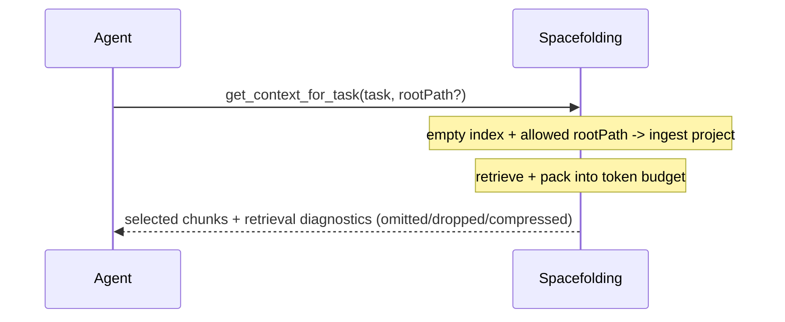
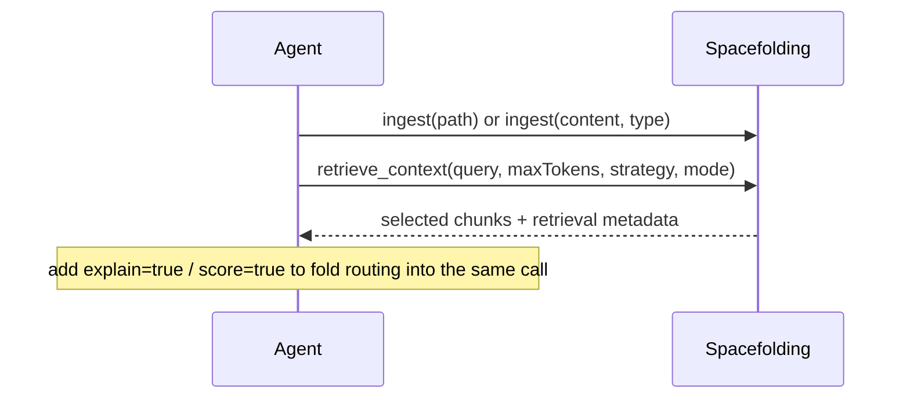

# MCP Tools Reference

Spacefolding advertises **4 canonical MCP tools** (what `ListTools` returns) to keep the on-the-wire surface token-cheap. All **12 legacy tool names remain callable as aliases** for backward compatibility — each keeps its own dedicated handler with its original output shape; they are simply not advertised. Existing integrations that call `ingest_project`, `score_context`, `explain_routing`, etc. continue to work unchanged via `CallTool`.

The source of truth for tool schemas is `src/mcp/server.ts`.

## Tool Inventory

The 4 canonical (advertised) tools:

| Tool | Purpose |
| --- | --- |
| `get_context_for_task` | One-call default. Ensures the index is populated (ingests `rootPath` first if empty and allowed), then retrieves + packs task-relevant context into the token budget. |
| `retrieve_context` | Hybrid RAG retrieval (structural / vector / text / graph) with token budget control. Optional `explain` / `score` flags fold routing explanation and hot/warm/cold scoring into the response. |
| `ingest` | Unified ingest. `mode: auto \| item \| project \| directory`. Item ingests a single content string; project/directory index a path tree (confined to `SF_INGEST_ROOTS`). |
| `get_relevant_memory` | Search warm/cold archived context by relevance with optional filters. |

## Common Workflow

The default one-call flow uses `get_context_for_task`; explicit ingest + retrieve is shown for when you want separate steps.



Explicit-step alternative:



## get_context_for_task

The composite one-call default. If the index is empty:

- with an allowed `rootPath` (within `SF_INGEST_ROOTS`): ingests that project first, then retrieves + packs;
- with no `rootPath`: returns an empty-index self-heal hint suggesting the canonical `ingest` tool;
- with a disallowed `rootPath`: refused (respects `SF_INGEST_ROOTS`).

When the index is populated, it retrieves and packs. The response mirrors `retrieve_context`'s diagnostics (omitted / dropped / compressed counts + per-chunk retrieval sources/scores/reasons) and adds `task`.

```json
{
  "task": "Fix retrieval budget overflow in the focused pipeline",
  "rootPath": "/path/to/project",
  "maxTokens": 50000,
  "strategy": "structural",
  "mode": "focused"
}
```

| Parameter | Required | Default | Description |
| --- | --- | --- | --- |
| `task` | Yes | — | The task to gather context for (used as the retrieval query). String. |
| `rootPath` | No | — | Project root to ingest first if the index is empty. Must be within `SF_INGEST_ROOTS`. |
| `maxTokens` | No | Auto | Maximum token budget for the packed context. |
| `strategy` | No | Adaptive | `structural`, `hybrid`, `vector`, `text`, or `graph`. |
| `mode` | No | `focused` | Retrieval selection mode: `focused`, `broad`, or `exhaustive`. |
| `topK` | No | Adaptive | Max retrieval candidates before selection and token budgeting. |
| `returnLimit` | No | `topK` | Max scored candidates to consider after retrieval and before token budgeting. |
| `maxHops` | No | Strategy-dependent | Max dependency-graph traversal hops (default `1` for `graph` strategy, `0` otherwise; disabled unless requested). |

## retrieve_context

Focused structural / vector / text retrieval with automatic token-budget control. Two optional boolean flags fold legacy tools into the response:

- `explain: true` folds `explain_routing` — adds a `routingExplanation` object (per-chunk tier / score / reasons + summary).
- `score: true` folds `score_context` — adds a `routing` object (`hot` / `warm` / `cold` id lists + `scores` + `reasons`).

```json
{
  "query": "where does focused retrieval set target budgets",
  "strategy": "structural",
  "mode": "focused",
  "maxTokens": 50000,
  "returnLimit": 15,
  "maxHops": 0,
  "format": "pack",
  "explain": false,
  "score": false
}
```

| Parameter | Required | Default | Description |
| --- | --- | --- | --- |
| `query` | Yes | — | Task-shaped search query. |
| `maxTokens` | No | Adaptive | Hard token budget for returned context. |
| `strategy` | No | Adaptive | `structural`, `hybrid`, `vector`, `text`, or `graph`. (`structural` when code symbols are indexed, otherwise adaptive on embedding provider.) |
| `mode` | No | `focused` | `focused` (compact high-confidence), `broad` (more coverage), or `exhaustive` (legacy breadth). |
| `topK` | No | Adaptive | Retrieval candidates before selection. |
| `returnLimit` | No | `topK` | Scored candidates considered before budget fill. |
| `maxHops` | No | Strategy-dependent | Graph traversal hops (default `1` for `graph`, `0` otherwise; disabled unless requested). |
| `format` | No | `json` | `json` returns structured fields. `pack` returns an agent-ready Markdown context pack with selected chunks, reasons, token use, and omissions. |
| `explain` | No | `false` | When `true`, include a `routingExplanation` object explaining why retrieved chunks were routed to their tiers. |
| `score` | No | `false` | When `true`, score + route all chunks into hot/warm/cold for this query and include the `routing` object in the response. |

See [retrieval pipeline](../concepts/retrieval-pipeline.md) for strategy and mode details.

## ingest

Unified ingest. `mode` selects the behavior; in `auto` (the default) intent is detected:

- `auto`: if `content` is present → single-item ingest; otherwise `path` is indexed as a project (via project-marker detection) or a plain directory.
- `item`: ingest a single content string (`content` + optional `type`).
- `project`: index a project tree — source plus README/docs, env examples, config, and agent instruction files.
- `directory`: bulk-index a directory tree (skips `node_modules`, `.git`, `dist`, and binary files).

Path modes (`project` / `directory` / `auto`-with-path) are confined to `SF_INGEST_ROOTS`; paths outside the allowlist are refused.

```json
{
  "mode": "project",
  "path": "/path/to/project",
  "includeDocs": true,
  "includeTests": false,
  "includeBenchmarks": false
}
```

Item-mode example:

```json
{
  "mode": "item",
  "source": "conversation",
  "content": "Must preserve existing CLI flags",
  "type": "constraint"
}
```

| Parameter | Required | Default | Description |
| --- | --- | --- | --- |
| `mode` | No | `auto` | `auto`, `item`, `project`, or `directory`. |
| `path` | Conditional | — | Absolute path to ingest (`project` / `directory` / `auto`-with-path). Must be within `SF_INGEST_ROOTS`. |
| `content` | Conditional | — | The context text to ingest (`item` mode). Alias for the text body. |
| `source` | No | `inline` (item) | Where this context came from (`item` mode, e.g. `file`, `diff`, `log`). |
| `type` | No | — | Chunk type for `item` mode, or an optional override type for `directory` mode. One of the [Chunk Types](#chunk-types) enum. |
| `language` | No | — | Programming language if code (`item` mode). |
| `includeDocs` | No | `true` | `project` mode: include `docs/**/*.md` and README files. |
| `includeTests` | No | `false` | `project` mode: include test/spec files and test directories. |
| `includeBenchmarks` | No | `false` | `project` mode: include benchmark directories. |

Project-marker detection (`auto` mode) treats a directory as a project root if it contains any of: `package.json`, `.git`, `pyproject.toml`, `Cargo.toml`, `go.mod`, `pom.xml`, `tsconfig.json`, or `CLAUDE.md`.

## get_relevant_memory

Search warm/cold archived storage for context relevant to a task, with optional filters.

```json
{
  "task": { "text": "How does JWT validation work?" },
  "filters": { "type": "code", "path": "src/auth" }
}
```

| Parameter | Required | Description |
| --- | --- | --- |
| `task` | Yes | Object with `text` (string, required); optional `type` and `priority`. |
| `filters` | No | Object with any of `source`, `type`, `tier`, `path`, `textContains`. |

## Legacy tool aliases

The following 12 legacy names are **not advertised** in `ListTools` but remain **fully callable via `CallTool`** — each has its own dedicated handler and preserves its pre-collapse output shape byte-for-byte. They are kept so existing integrations, scripts, and docs that reference them do not break.

| Legacy name | Maps to / behavior |
| --- | --- |
| `ingest_context` | Still callable; item ingest. Canonical equivalent: `ingest` with `mode: "item"`. |
| `ingest_project` | Still callable; project ingest with `includeDocs` / `includeTests` / `includeBenchmarks`. Canonical equivalent: `ingest` with `mode: "project"`. |
| `ingest_directory` | Still callable; bulk directory ingest. Canonical equivalent: `ingest` with `mode: "directory"`. |
| `retrieve_context` | Still callable; **is** a canonical tool (also advertised). |
| `get_relevant_memory` | Still callable; **is** a canonical tool (also advertised). |
| `score_context` | Still callable; score + route chunks into hot/warm/cold. Canonical equivalent: `retrieve_context` with `score: true` (folded into the response). |
| `explain_routing` | Still callable; per-chunk tier/score/reason explanation. Canonical equivalent: `retrieve_context` with `explain: true`. |
| `compress_context` | Still callable; compress specified chunks into a structured summary. (No canonical fold — keep using the alias.) |
| `iterative_retrieve` | Still callable; multi-round retrieval with query expansion. (No canonical fold — keep using the alias.) |
| `update_context_graph` | Still callable; add/remove dependency links. (No canonical fold — keep using the alias.) |
| `list_context` | Still callable; show ingested chunk counts, token totals, per-file breakdown. (No canonical fold — keep using the alias.) |
| `delete_context` | Still callable; delete chunks by ID. (No canonical fold — keep using the alias.) |

The empty-index self-heal hint (returned by `retrieve_context` / `get_relevant_memory` / `get_context_for_task` against an empty index) now suggests the canonical `ingest` tool.

## Chunk Types

The `type` enum accepted by `ingest` (item mode) and `ingest_context`:

| Type | Use |
| --- | --- |
| `constraint` | Hard requirements and rules. |
| `instruction` | User requests and action items. |
| `code` | Source code. |
| `diff` | Git diffs and patches. |
| `log` | Error logs and command output. |
| `reference` | Documentation and API references. |
| `summary` | Prior summaries. |
| `background` | General project context. |
| `fact` | General factual context. |
